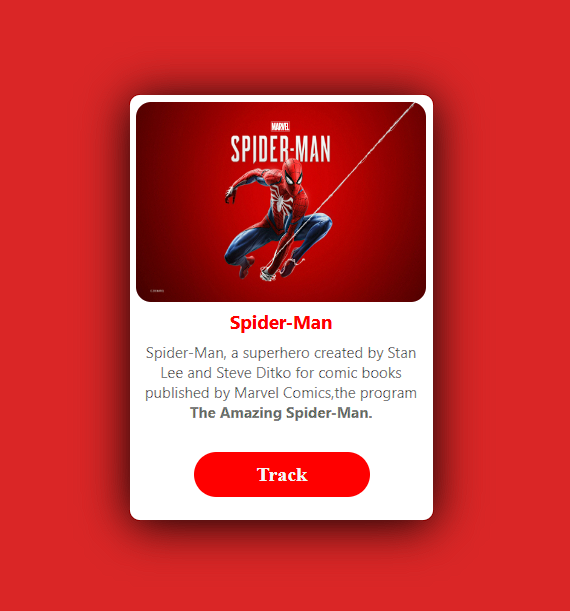

# Card_CSS

A simple card design created using HTML and CSS.

## Deployment-Link:

https://shayak-98.github.io/Card_CSS/

## Demo-image:

## Technologies Used:

- HTML
- CSS

## Features:

- Simple card layout
- CSS styling
- Centered content
- Styled button

## What I Learned:

- CSS Box Model
- Flexbox
- Centering elements
- Styling buttons
- Basic Git and GitHub
